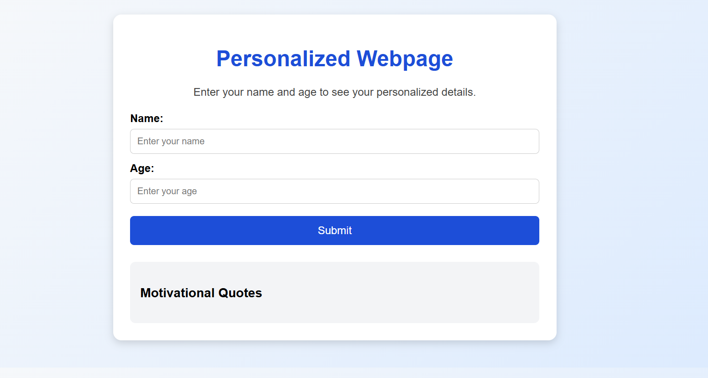

# Personalized Webpage
## Project Description
>This project is a simple interactive webpage built using HTML, CSS, and JavaScript. It collects a user’s name and age, then displays personalized information based on the input.
>The application demonstrates fundamental JavaScript concepts such as variables, conditional statements, loops, functions, events, and local storage.

## Features
- User input form for name and age
- Personalized greeting message
- Age verification (adult or minor)
- Age converted into months
- Motivational quotes displayed using a loop
- Data saved using browser localStorage
- Clean responsive layout
## Technologies Used
- HTML5 — page structure
- CSS — styling and layout
- JavaScript
## JavaScript Concepts Applied
- Variables and data types
- Type conversion
- String concatenation
- Conditional statements (if...else)
- Loops (for loop)
- Functions
- Event handling
- Local storage
## How It Works

- The user enters their name and age.
- The program stores the data in local storage.
- A personalized greeting is displayed.
- The system checks if the user is an adult or minor.
- The age is converted into months.
- Motivational quotes appear on the page.
- Saved data is automatically loaded when the page is reopened.
 ## Screenshots
  
  ## Live url 
 > Github deployed page
  [Live Demo](https://josephgakono.github.io/personalized_webpage/)
  ## Github Repository
  [Github Repository](https://github.com/josephgakono/personalized_webpage)